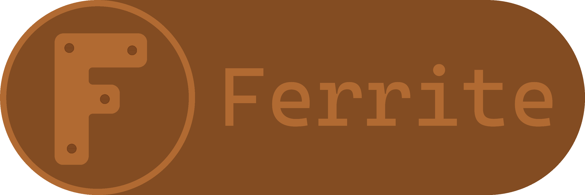

# 

A bare-metal kernel written from scratch in Rust, with the end goal of being drop-in compatible with the Linux kernel (ABI-compatibility).
The intention is to be able to run unmodified linux binaries, aswell as provide more advanced capabilites
such as intent-aware scheduling, real-time scheduling/scheduling hints ("don't preempt me for this long"), a namespaced VFS and more.

The kernel lives under `src/kernel/src` as a cargo workspace member.
Architecture-specific code is isolated under `arch/<arch>/`, `logging/<arch>/`, `mem/<arch>/`;
`mod.rs` selects the right submodule at compile time via `#[cfg(target_arch)]` and re-exports it.

---

## Requirements

- **Docker Desktop** — compilation runs inside a Debian + nightly Rust container
- **Python 3.11+** — build and docs scripts
- **QEMU** with x86-64 support
- **OVMF firmware** (`code.fd` + `vars.fd`) placed in `run/deps/ovmf/` — available from [rust-osdev/ovmf-prebuilt](https://github.com/rust-osdev/ovmf-prebuilt)

---

## Configuration

`run/config/build.toml` controls build behavior. The file is not committed — create it before first use.

```toml
[options]
profile = "debug"       # "debug" or "release"

[features]
debug-logging = true    # enable kdebug! log output
vmm-debug-logging = true  # enable kdebug! log output from the VMM

[extra_paths]
paths = [               # directories appended to PATH at script startup
    "C:/Program Files/qemu",
    "C:/Program Files/Docker/Docker/resources/bin",
]
```

You can omit `[extra_paths]` entirely if everything is already on your PATH.

---

## Scripts

### `scripts/x86_64/build.py` — build and run

```
python scripts/x86_64/build.py build   # compile kernel + create ISO (skips unchanged sources)
python scripts/x86_64/build.py run     # launch QEMU with UEFI firmware
python scripts/x86_64/build.py all     # build then run
python scripts/x86_64/build.py clean   # delete build/ and target/
```

Compilation happens inside Docker; QEMU runs natively on the host. Incremental builds use MD5 hashing to skip the Docker step when nothing has changed. There is no `cargo test` — the bare-metal target does not support it.

### `scripts/docs.py` — rustdoc

```
python scripts/docs.py build   # generate rustdoc for src/kernel inside Docker
python scripts/docs.py open    # open the generated docs in the browser
python scripts/docs.py all     # build then open (default)
python scripts/docs.py clean   # delete generated docs
```

---

This project is licensed under the **GNU General Public License v3.0** (GPL-3.0-only). See [LICENSE](LICENSE) for details.
